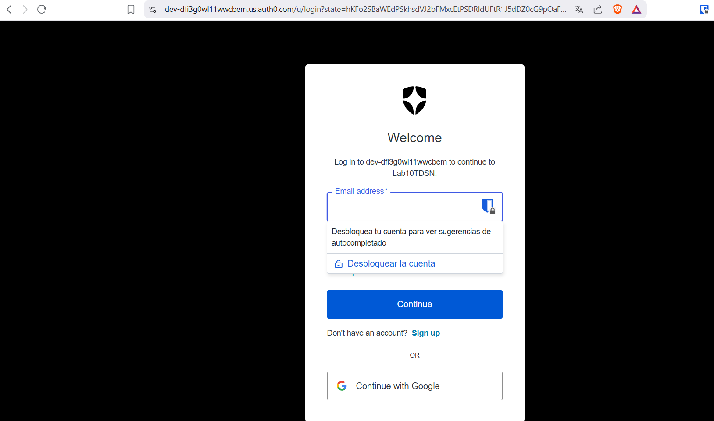
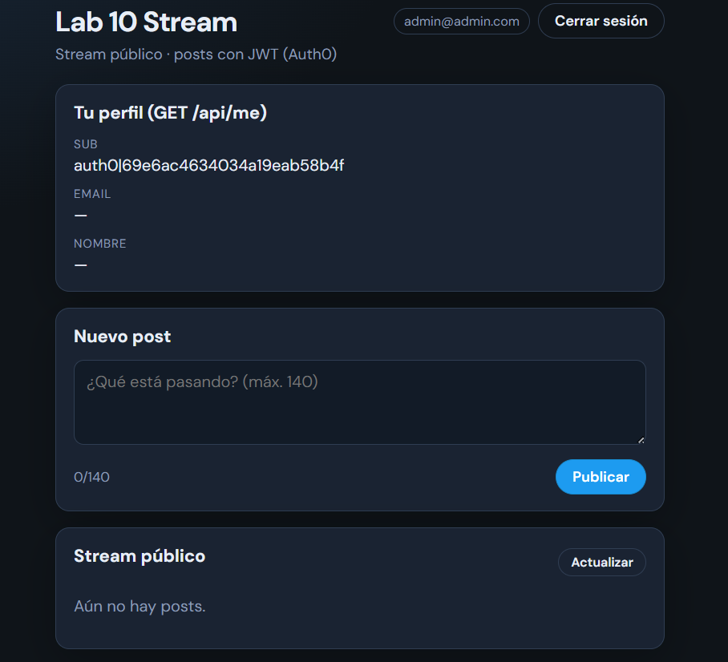
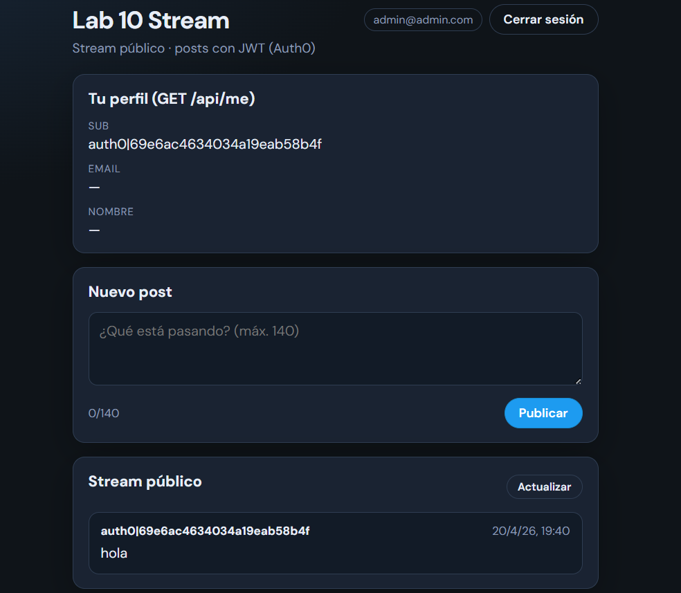
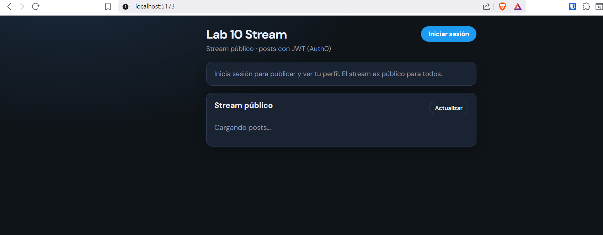
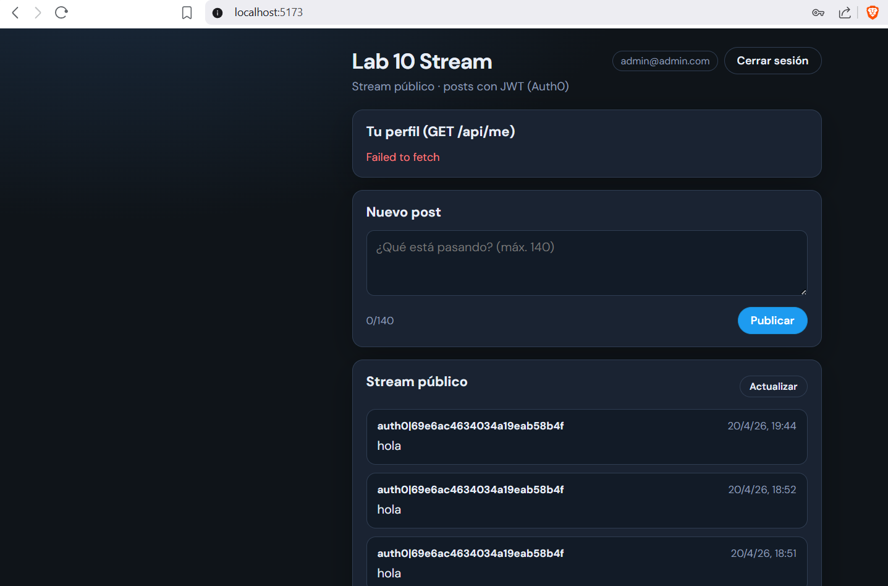

# Lab 10 TDSN — Twitter-like con Auth0 (monolito + microservicios serverless)

**Autores:** Stiven Esneider Pardo Gutiérrez, Allan steef Contreras Rodriguez, Josué David Hernandez Martinez.

Aplicación tipo Twitter: stream público de posts (máx. 140 caracteres), login con Auth0 y API protegida con JWT y scopes. El repositorio conserva el **monolito Spring Boot** como referencia y añade una **refactorización a microservicios** desplegables como **AWS Lambda** (serverless) detrás de un **HTTP API** (API Gateway v2) definido con **AWS SAM**.

---

## Verificación de la migración monolito → microservicios

| Criterio | Estado | Notas |
|----------|--------|--------|
| Al menos 3 microservicios independientes | Cumplido | **User Service** (`UserHandler`), **Posts Service** (`PostsHandler`), **Stream / Feed Service** (`StreamHandler`) en `microservices/`. |
| Cada uno como AWS Lambda | Cumplido | Handlers Java 17 (`RequestHandler<APIGatewayV2HTTPEvent, …>`), empaquetado con Maven Shade (`*-aws.jar`). Plantilla `microservices/template.yaml` (SAM). |
| Separación de responsabilidades | Cumplido | Usuario (`/me` + persistencia perfil), creación de posts (`POST /posts`), lectura del feed (`GET /posts`, `GET /stream`). |
| Auth0 / JWT | Cumplido | Monolito: Spring OAuth2 Resource Server. Lambdas: validación manual con JWKS (`common-auth` + Auth0). Mismos scopes: `write:posts`, `read:profile`. |
| Persistencia | Cambio intencional | Monolito: **H2** + JPA. Microservicios: **DynamoDB** (tablas `UsersTable`, `PostsTable`). No hay migración automática de datos H2 → DynamoDB: es un cambio de arquitectura de persistencia típico al pasar a serverless. |
| Frontend | Compatible | `frontend/src/api.js` usa el monolito por defecto (`VITE_API_BASE_URL` + rutas `/api/...`). Si defines `VITE_MICROSERVICES_BASE_URL`, apunta al HTTP API de SAM (rutas `/posts`, `/me` sin `/api`). |

**Conclusión:** la separación lógica y de despliegue es coherente con el enunciado. El monolito **no se eliminó**: sirve para desarrollo local y comparación. Los Lambdas son la implementación “microservicio” desacoplada; el build SAM requiere instalar antes el módulo compartido en el repositorio Maven local (ver más abajo).

---

## Comparación: monolito vs microservicios

| Aspecto | Monolito (`backend/`) | Microservicios (`microservices/`) |
|---------|------------------------|-----------------------------------|
| Despliegue | Un solo JAR / proceso Spring Boot | Tres funciones Lambda + API Gateway HTTP API |
| Rutas HTTP | Prefijo `/api` (`/api/posts`, `/api/me`) | Raíz del API (`/posts`, `/stream`, `/me`) |
| Autenticación JWT | Filtros Spring Security + `Jwt` | `Auth0JwtVerifier` (JWKS, issuer, audience, scopes) |
| Datos | JPA + H2 | AWS SDK v2 + DynamoDB |
| Documentación API | Swagger / OpenAPI en el monolito | OpenAPI opcional en API Gateway (no generado aquí) |
| Escalado | Vertical / réplicas del monolito | Escalado por invocación (serverless) |

### Capturas de prueba (`img/`)

Evidencias del **frontend** (`npm run dev`, típicamente `http://localhost:5173`) contra el **monolito** (variables por defecto: `VITE_API_BASE_URL`, sin `VITE_MICROSERVICES_BASE_URL`) y contra **microservicios** (`VITE_MICROSERVICES_BASE_URL` apuntando a `sam local` o al `HttpApiUrl` desplegado).

#### Monolito (Spring Boot, rutas `/api/...`)








#### Microservicios (Lambda + HTTP API)

| Archivo | Qué muestra |
|---------|-------------|
| `micro1.png` | Sin iniciar sesión; **Stream público** en estado **“Cargando posts…”** mientras el frontend llama al API de SAM / desplegado. |
| `micro2.png` | Sesión iniciada; **stream** con posts visibles; la tarjeta de perfil puede mostrar **Failed to fetch** si `GET /me` falla aunque `GET /posts` responda (típico al depurar red DynamoDB o reinicios de `sam local`). |





---

## Código: qué se “movió” del monolito a los Lambdas (extractos)

### 1) Posts + stream en el monolito → dos Lambdas

**Antes — controlador único** (`PostController`: lectura y escritura en la misma app):

```33:54:backend/src/main/java/com/lab10/tdsn/web/PostController.java
    @GetMapping("/stream")
    @Operation(summary = "Stream global (público)", description = "Devuelve todos los posts ordenados del más reciente al más antiguo. No requiere autenticación.")
    public List<PostResponse> stream() {
        return postService.getPublicStream();
    }

    @GetMapping("/posts")
    @Operation(summary = "Listar posts (público)", description = "Alias del stream global. No requiere autenticación.")
    public List<PostResponse> posts() {
        return postService.getPublicStream();
    }

    @PostMapping("/posts")
    @ResponseStatus(HttpStatus.CREATED)
    @Operation(summary = "Crear post", description = "Requiere JWT con scope `write:posts` y audience de la API.")
    @SecurityRequirement(name = "bearer-jwt")
    public PostResponse create(
            @AuthenticationPrincipal Jwt jwt,
            @Valid @RequestBody CreatePostRequest body
    ) {
        return postService.createPost(jwt, body);
    }
```

**Después — solo creación en Posts Service** (`PostsHandler`: POST, JWT + scope, escritura DynamoDB):

```33:84:microservices/posts-service/src/main/java/com/lab10/ms/posts/PostsHandler.java
    @Override
    public APIGatewayV2HTTPResponse handleRequest(APIGatewayV2HTTPEvent event, Context context) {
        try {
            String method = event.getRequestContext().getHttp().getMethod();
            if ("OPTIONS".equalsIgnoreCase(method)) {
                return APIGatewayV2HTTPResponse.builder()
                        .withStatusCode(204)
                        .withHeaders(LambdaHttp.corsHeaders())
                        .build();
            }

            if (!"POST".equalsIgnoreCase(method)) {
                return LambdaHttp.text(405, "{\"error\":\"Método no permitido\"}");
            }

            Auth0JwtVerifier verifier = verifier();
            String auth = header(event, "authorization");
            DecodedJWT jwt = verifier.verifyBearer(auth);
            if (!Auth0JwtVerifier.hasScope(jwt, "write:posts")) {
                return LambdaHttp.text(403, "{\"error\":\"Scope write:posts requerido\"}");
            }

            String sub = jwt.getSubject();
            String email = Auth0JwtVerifier.claimString(jwt, "email");
            String name = Auth0JwtVerifier.firstNonBlank(
                    Auth0JwtVerifier.claimString(jwt, "name"),
                    Auth0JwtVerifier.claimString(jwt, "nickname"),
                    email
            );
            String picture = Auth0JwtVerifier.claimString(jwt, "picture");

            String usersTable = requiredEnv("USERS_TABLE");
            String postsTable = requiredEnv("POSTS_TABLE");
            putUser(usersTable, sub, email, name, picture);

            JsonNode root = JSON.readTree(event.getBody() == null ? "{}" : event.getBody());
            String content = root.path("content").asText("").trim();
            if (content.isEmpty() || content.length() > 140) {
                return LambdaHttp.text(400, "{\"error\":\"content: 1-140 caracteres\"}");
            }

            long createdAt = System.currentTimeMillis();
            String postId = UUID.randomUUID().toString();
            putPost(postsTable, postId, sub, content, createdAt);

            Map<String, Object> response = new HashMap<>();
            response.put("id", postId);
            response.put("content", content);
            response.put("authorId", sub);
            response.put("createdAt", Instant.ofEpochMilli(createdAt).toString());
            response.put("authorName", name != null ? name : sub);
            return LambdaHttp.json(201, response);
```

**Después — lectura del feed en Stream Service** (`StreamHandler`: GET público, agrega `authorName` como hacía `PostService` con repositorios):

```35:49:backend/src/main/java/com/lab10/tdsn/service/PostService.java
    @Transactional(readOnly = true)
    public List<PostResponse> getPublicStream() {
        List<Post> posts = postRepository.findAllByOrderByCreatedAtDesc();
        Set<String> authorIds = posts.stream().map(Post::getAuthorId).collect(Collectors.toSet());
        Map<String, String> names = appUserRepository.findAllById(authorIds).stream()
                .collect(Collectors.toMap(AppUser::getId, u -> u.getName() != null ? u.getName() : u.getId()));
        return posts.stream()
                .map(p -> new PostResponse(
                        p.getId(),
                        p.getContent(),
                        p.getAuthorId(),
                        p.getCreatedAt(),
                        names.getOrDefault(p.getAuthorId(), null)
                ))
                .toList();
    }
```

```56:86:microservices/stream-service/src/main/java/com/lab10/ms/stream/StreamHandler.java
            String postsTable = requiredEnv("POSTS_TABLE");
            String usersTable = requiredEnv("USERS_TABLE");

            List<Map<String, AttributeValue>> rows = scanAllPosts(postsTable);
            rows.sort(Comparator.comparingLong(StreamHandler::createdAtMillis).reversed());

            Set<String> authorIds = new HashSet<>();
            for (Map<String, AttributeValue> row : rows) {
                AttributeValue aid = row.get("authorId");
                if (aid != null && aid.s() != null) {
                    authorIds.add(aid.s());
                }
            }
            Map<String, String> names = batchLoadNames(usersTable, authorIds);

            List<Map<String, Object>> out = new ArrayList<>();
            for (Map<String, AttributeValue> row : rows) {
                String postId = attrS(row, "postId");
                String content = attrS(row, "content");
                String authorId = attrS(row, "authorId");
                long ts = createdAtMillis(row);
                Map<String, Object> dto = new HashMap<>();
                dto.put("id", postId);
                dto.put("content", content);
                dto.put("authorId", authorId);
                dto.put("createdAt", Instant.ofEpochMilli(ts).toString());
                dto.put("authorName", names.get(authorId));
                out.add(dto);
            }

            return LambdaHttp.json(200, out);
```

### 2) Perfil `/api/me` en el monolito → User Service

**Antes:**

```26:36:backend/src/main/java/com/lab10/tdsn/web/MeController.java
    @GetMapping("/me")
    @Operation(summary = "Usuario actual", description = "Requiere JWT con scope `read:profile`.")
    @SecurityRequirement(name = "bearer-jwt")
    public UserProfileResponse me(@AuthenticationPrincipal Jwt jwt) {
        AppUser user = userSyncService.upsertFromJwt(jwt);
        return new UserProfileResponse(
                user.getId(),
                user.getEmail(),
                user.getName(),
                user.getPictureUrl()
        );
    }
```

**Después** (`UserHandler`: mismo contrato JSON `sub`, `email`, `name`, `picture`; persiste en DynamoDB):

```42:71:microservices/user-service/src/main/java/com/lab10/ms/user/UserHandler.java
            String path = event.getRawPath() == null ? "" : event.getRawPath();
            if (!path.endsWith("/me")) {
                return LambdaHttp.text(404, "{\"error\":\"No encontrado\"}");
            }

            Auth0JwtVerifier verifier = verifier();
            String auth = header(event, "authorization");
            DecodedJWT jwt = verifier.verifyBearer(auth);
            if (!Auth0JwtVerifier.hasScope(jwt, "read:profile")) {
                return LambdaHttp.text(403, "{\"error\":\"Scope read:profile requerido\"}");
            }

            String sub = jwt.getSubject();
            String email = Auth0JwtVerifier.claimString(jwt, "email");
            String name = Auth0JwtVerifier.firstNonBlank(
                    Auth0JwtVerifier.claimString(jwt, "name"),
                    Auth0JwtVerifier.claimString(jwt, "nickname"),
                    email
            );
            String picture = Auth0JwtVerifier.claimString(jwt, "picture");

            String table = requiredEnv("USERS_TABLE");
            putUser(table, sub, email, name, picture);

            Map<String, Object> body = new HashMap<>();
            body.put("sub", sub);
            body.put("email", email);
            body.put("name", name);
            body.put("picture", picture);
            return LambdaHttp.json(200, body);
```

### 3) Frontend: misma app, dos modos de URL

Si `VITE_MICROSERVICES_BASE_URL` está vacío, se usa el monolito (`/api/posts`, `/api/me`). Si está definida, las mismas funciones apuntan al API Gateway (`/posts`, `/me`). Ver `frontend/src/api.js`.

---

## Estructura del repositorio

| Ruta | Rol |
|------|-----|
| `backend/` | Monolito Spring Boot (referencia + desarrollo local) |
| `frontend/` | SPA React + Auth0 |
| `microservices/` | Parent Maven + `common-auth` + Lambdas + `template.yaml` (SAM) |
| `img/` | Capturas de prueba del monolito y microservicios (ver sección anterior) |

---

## Monolito — ejecutar en local

Desde `backend/`:

```bash
mvn spring-boot:run
```

- API: `http://localhost:8080`
- Swagger: `http://localhost:8080/swagger-ui.html`

Variables: `backend/.env.example`.

---

## Microservicios — compilar y desplegar (SAM + Lambda)

### 1) Compilar todos los JAR (incluye `common-auth`)

Desde `microservices/`:

```bash
mvn clean install -DskipTests
```

Esto publica `common-auth` en el repositorio Maven local; **es necesario** antes de `sam build` para que cada `CodeUri` (user/posts/stream) resuelva la dependencia.

### 2) SAM build

```bash
cd microservices
sam build --parameter-overrides Auth0Domain=TU_DOMINIO Auth0Audience=TU_AUDIENCE
```

### 3) API local (`sam local start-api`) con DynamoDB Local

Las Lambdas usan DynamoDB. En local conviene **DynamoDB Local** en Docker y la misma **red Docker** que SAM (`tdsn-local`), con el endpoint `http://ddb:8000` en `env-local.json`.

**Pasos (PowerShell)**

1. Red y DynamoDB Local en segundo plano (nombre **`ddb`**, red **`tdsn-local`**):

```powershell
docker network create tdsn-local 2>$null
docker rm -f ddb 2>$null
docker run -d --network tdsn-local --name ddb -p 8000:8000 amazon/dynamodb-local
```

2. Crear tablas (sin AWS CLI instalado en el host; usa la imagen oficial):

```powershell
docker run --rm --network tdsn-local -e AWS_ACCESS_KEY_ID=local -e AWS_SECRET_ACCESS_KEY=local amazon/aws-cli dynamodb create-table --endpoint-url http://ddb:8000 --region us-east-1 --table-name tdsn-local-users --attribute-definitions AttributeName=userId,AttributeType=S --key-schema AttributeName=userId,KeyType=HASH --billing-mode PAY_PER_REQUEST

docker run --rm --network tdsn-local -e AWS_ACCESS_KEY_ID=local -e AWS_SECRET_ACCESS_KEY=local amazon/aws-cli dynamodb create-table --endpoint-url http://ddb:8000 --region us-east-1 --table-name tdsn-local-posts --attribute-definitions AttributeName=postId,AttributeType=S --key-schema AttributeName=postId,KeyType=HASH --billing-mode PAY_PER_REQUEST
```

3. Copia `microservices/env-local.example.json` a `env-local.json` y ajusta Auth0 y tablas si aplica (por defecto apunta a `http://ddb:8000` y a `tdsn-local-users` / `tdsn-local-posts`).

4. Build y arranque del API (tras cambiar código Java, vuelve a ejecutar `sam build`):

```powershell
cd microservices
mvn clean install -DskipTests
sam build --parameter-overrides Auth0Domain=TU_DOMINIO Auth0Audience=TU_AUDIENCE
sam local start-api
```

`microservices/samconfig.toml` fija el template construido (`.aws-sam/build/template.yaml`), la red `tdsn-local` y `env-local.json`. Equivalente sin archivo de configuración:

`sam local start-api --template-file .aws-sam/build/template.yaml --docker-network tdsn-local --env-vars env-local.json`

### 4) Desplegar en AWS

```bash
cd microservices
sam deploy --guided
```

El template crea: HTTP API, tablas DynamoDB, tres Lambdas y permisos IAM. La salida `HttpApiUrl` es la base para el frontend (`VITE_MICROSERVICES_BASE_URL`).

Parámetros del template: `Auth0Domain`, `Auth0Audience` (mismos criterios que en el monolito).

---

## Frontend

```bash
cd frontend
npm install
npm run dev
```

Variables: `frontend/.env.example` (`VITE_MICROSERVICES_BASE_URL` opcional).

---

## Pruebas (monolito)

```bash
cd backend
mvn test
```

---

## Notas de diseño ..

- **Stream Service** usa `Scan` sobre posts para el laboratorio; en producción convendría un modelo de datos con orden explícito (p. ej. GSI por tiempo).
- **User Service** y **Posts Service** escriben en la tabla de usuarios para mantener `authorName` en el feed sin acoplar Lambdas entre sí por HTTP.
- CORS: cabeceras básicas en respuestas Lambda; además el HTTP API en SAM define CORS.


## Video evidencia del funcionamiento de la aplicacion desplegada 

Dentro del repositorio esta la evidencia como "Despliegue de la aplicacion.mp4", en este se evidencia la creacion de la funcion en aws, ademas de el despliegue en netlify, 
esto debido a que segun los permisos de aws, el fronted debio ser desplegado en dicha plataforma, se evidencia tambien el inicio de sesion con google funcionando correctamente
y como las publicaciones se muestran y actualizan correctamente al momento de ser hechas, ademas de esto, se realizo la implementacion usando auth0 para que todo funcionara 
correctamente.
